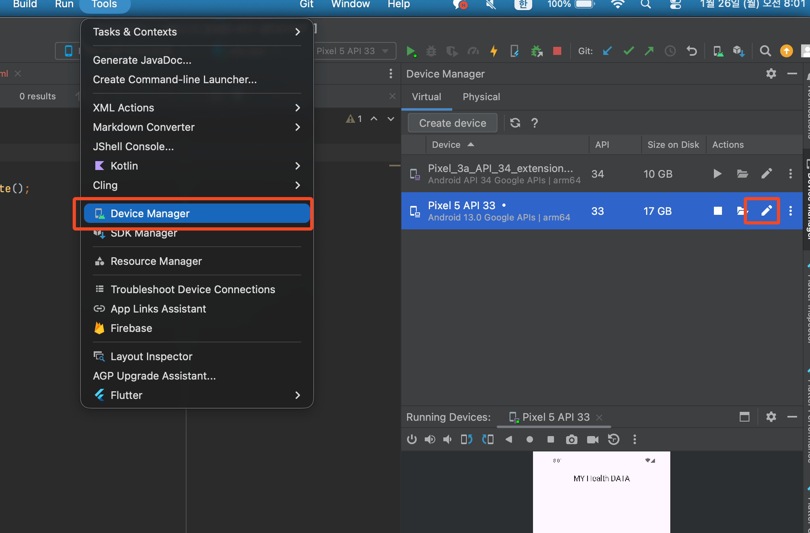

# 환경 세팅




체크해제.

이제 상태바와 밑에 네비게이션바의 색상을 다르게 설정하여, 우리가 작업할 수 있는 공간과 작업할 수 없는 공간을 확실하게 나눠볼것이다. 밑에와 같이 하늘색과 노란색으로 색을 바꿨다.


1. appBar 을 활용해서 SystemUI 을 변경해보겠다.

  ```dart
  return MaterialApp(
    debugShowCheckedModeBanner: false,
    theme: ThemeData(
      appBarTheme: AppBarTheme(
        systemOverlayStyle: SystemUiOverlayStyle(
          statusBarColor: Colors.blue[300],
          statusBarBrightness: Brightness.light,
          systemNavigationBarColor: Colors.yellow[300],
          systemNavigationBarIconBrightness: Brightness.dark,
        )
      ),
    ),
    home: Scaffold(
      appBar: AppBar(
        centerTitle: true,
        title: Text('SystemUiOverlayStyle1'),
      ),
      backgroundColor: Colors.white,
    ),
  );
  ```

위에 처럼 App(앱)의 theme(테마) 설정으로 모든 페이지가 이 설정을 따르게 하고, 그 안에 appBar theme 을 설정하고 그 안에 있는 system 을 Overlay(**씌우다**) 하게 되었다. 왜 system 설정을 appBar 에서 할까? 라는 의문이 들 수 있다. 이건 그냥 appBar 와 상태바가 가까워서 이쪽에서 하기로 Flutter 팀에서 결정했다고 한다;;;

그리고 제일 중요한 것은 appBar 가 선언이 되어 있지 않았으면 이건 동작을 하지 않는다!!

2. `AnnotatedRegion` 위젯으로 감싸기.

Annotated → 주석,설명 이런 뜻이다. 그리고 Region 지역 이라는 뜻인데, 그냥 해석해보면 내가 정한 특정 지역을 의미한다. 그 지역에서 어떤걸 할것이냐? `SystemUiOverlayStyle` 을 하겠다고 타입을 밑에와 같이 정해주면 끝.

  ```dart
  return MaterialApp(
    debugShowCheckedModeBanner: false,
    home: AnnotatedRegion<SystemUiOverlayStyle>(
      value: SystemUiOverlayStyle(
        statusBarColor: Colors.blue[300],
        statusBarBrightness: Brightness.light,
        systemNavigationBarColor: Colors.yellow[300],
        systemNavigationBarIconBrightness: Brightness.dark,
      ),
      child: Scaffold(
        backgroundColor: Colors.white,
      ),
    ),
  );
  ```

1. 진짜 시스템에다가 바꿔버리기.

  ```dart
  void main() {
    WidgetsFlutterBinding.ensureInitialized();
    SystemChrome.setSystemUIOverlayStyle(
      SystemUiOverlayStyle(
        statusBarColor: Colors.blue[300],
        statusBarBrightness: Brightness.light,
        systemNavigationBarColor: Colors.yellow[300], // 제스처 네비게이션에게는 Navigattion 설정들이 무시가 됩니다.
        systemNavigationBarIconBrightness: Brightness.dark,
      )
    );
    runApp(MyApp1());
  }
  ```

처음 `WidgetsFlutterBinding.ensureInitialized();` 는 Flutter 와 Widget이 Binding(연결)이 되고, ensure(확실히) Initalized(초기화)가 되어서 System 설정들을 할 수 있을 때 까지 기다리는것이다.

그리고 `SystemChrome` 여기서 Chrome 은 ***래픽 사용자 인터페이스에서 창틀***을 가르킨다. 그래서 그 안에 setSystemUI 사용해서~ SystemUi 이거 클래스로 설정한 것이다.

주석에 적힌것 처럼 이렇게 생긴 체스처 네비게이션에게는 NavigatorBar 가 먹히질 않는다. 투명이여서;;

